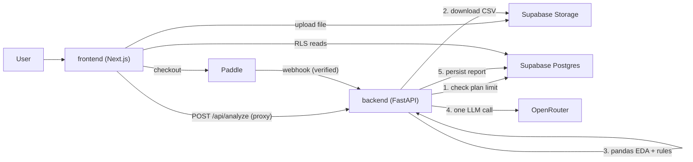

# DataScope

Upload a CSV. Get a plain-English exploratory data analysis — narrated
insights plus charts, not just raw statistics.

Two services, deliberately separate:

| Service | Stack | Path |
| --- | --- | --- |
| `frontend` | Next.js (App Router), Tailwind, shadcn/ui, Recharts | `/frontend` |
| `backend` | Python, FastAPI, pandas, Supabase, OpenRouter, Paddle | `/backend` |

Infrastructure: **Supabase** (Postgres, Google OAuth, Storage) ·
**Paddle** (subscriptions) · **OpenRouter** (narrative LLM) · **Railway**
(hosting both services).

## Architecture



The analysis engine runs **only** in the backend. Next.js API routes are thin
proxies; the browser never talks to the backend directly.

## Setup

### 1. Supabase

1. Create a project.
2. Enable **Google OAuth** under Authentication → Providers.
3. Run `db/schema.sql` in the SQL editor. It creates the four tables, RLS
   policies, the `handle_new_user` trigger, storage buckets + policies,
   `increment_reports_used()`, and `reset_monthly_usage()`.
4. (Recommended) Add a **scheduled function** (Dashboard → Cron) that runs
   `select public.reset_monthly_usage();` on the 1st of each month. Alternative:
   a Railway cron hitting the DB directly.

### 2. Backend

```bash
cd backend
python -m venv .venv && source .venv/bin/activate
pip install -r requirements.txt
```

Env vars (see `backend/.env.example`):

| Var | Purpose |
| --- | --- |
| `SUPABASE_URL` | Supabase project URL |
| `SUPABASE_SERVICE_KEY` | service-role key (bypasses RLS — backend only) |
| `SUPABASE_ANON_KEY` | anon key |
| `OPENROUTER_API_KEY` | OpenRouter key for narration |
| `PADDLE_API_KEY` | Paddle API key |
| `PADDLE_WEBHOOK_SECRET` | Paddle webhook secret (signature verification) |
| `OPENROUTER_MODEL` | optional; defaults to a free Qwen endpoint |

```bash
uvicorn main:app --reload --port 8000
```

### 3. Frontend

```bash
cd frontend
npm install
cp .env.example .env.local   # fill in values
npm run dev
```

Env vars (`frontend/.env.example`): `NEXT_PUBLIC_SUPABASE_URL`,
`NEXT_PUBLIC_SUPABASE_ANON_KEY`, `BACKEND_URL` (server-side only — the
Railway-internal URL), `NEXT_PUBLIC_PADDLE_CLIENT_TOKEN`,
`NEXT_PUBLIC_PADDLE_PRO_PRICE_ID`.

### 4. Paddle

1. Create a **Pro subscription** product/price in Paddle; note the price ID
   and client token.
2. Configure the webhook endpoint → `https://<backend>/webhooks/paddle` and
   copy the webhook secret into `PADDLE_WEBHOOK_SECRET`.
3. Set `NEXT_PUBLIC_PADDLE_PRO_PRICE_ID` and
   `NEXT_PUBLIC_PADDLE_CLIENT_TOKEN` on the frontend.

The frontend passes `user_id` as checkout custom data; the backend uses it to
route `subscription.created/updated/cancelled` events to the right profile.

## Deployment (Railway)

One repo, two services — set each service's root to the subfolder.

**Backend service** (`/backend`): Dockerfile present, or Railway picks it up.
`backend/railway.json` sets the start command.

**Frontend service** (`/frontend`): Nixpacks build. `frontend/railway.json`
sets `npm run build && npm start`.

Set `BACKEND_URL` on the frontend to the backend's `*.up.railway.app` URL (or
its private domain) and add the service-to-service firewall rule.

## How a report is produced

1. Frontend uploads the CSV straight to Supabase Storage
   (`uploads/{user_id}/{filename}`).
2. Frontend calls `POST /api/analyze` (proxied to backend `/analyze`).
3. Backend enforces the **free = 2 reports/month** limit server-side (402 +
   upgrade message if exceeded).
4. Backend inserts the `uploads` row (`processing`), downloads the file, and
   runs the EDA agent: pandas computes all statistics, rule-based code picks
   findings, and the LLM narrates them in exactly one call.
5. Results are written to `reports`, the upload flips to `done`, the counter
   increments. Any failure flips the upload to `failed` — never stuck.
6. Pro users can download a server-side PDF (ReportLab).

## Notes

- The LLM never reads the raw CSV and never computes statistics — it only
  interprets deterministic findings. This keeps output accurate and tokens low.
- Every `uploads` row terminates in `done` or `failed`.
- All tables use RLS scoped to `auth.uid()`.
